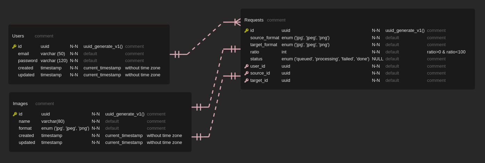

# image-converter

Service that expose a RESTful API to convert JPEG to PNG and vice versa and compress the image 
with the compression ratio specified by the user. The user has the ability to view
the history and status of their requests (for example, queued, processed, completed) and upload 
the original image and the processed one.

# Architecture Diagram

# Endpoints
- /user/login - user authorization [POST]
- /user/signup - user registration [POST]
- /conversion - convert needed image [POST]
- /images/{id} - get needed image [GET]
- /requests - get the user's requests history [GET]
# Database Scheme

# Environment

