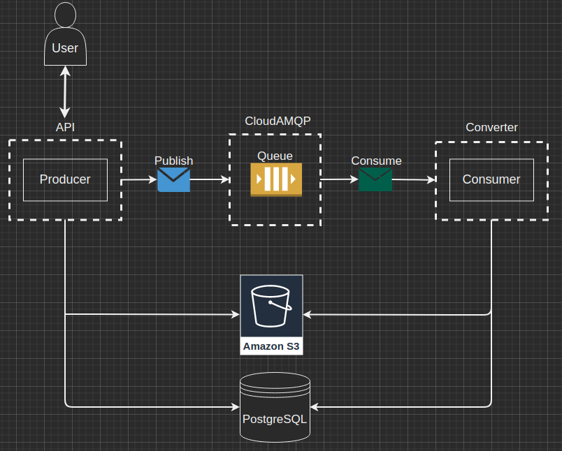

# photo-converter
Service that expose a RESTful API to convert JPEG to PNG and vice versa and compress the image 
with the compression ratio specified by the user. The user has the ability to view
the history and status of their requests (for example, queued, processed, completed) and upload 
the original image and the processed one.
# Architecture Diagram

# Endpoints
- /user/requests - view user requests history [GET]
- /user/login - user authorization [POST]
- /user/signup - user registration [POST]
- /user/logout - log out of the user [GET]
- /convert - convert photo [POST]
- /download/{photoId} - download needed photo [GET]